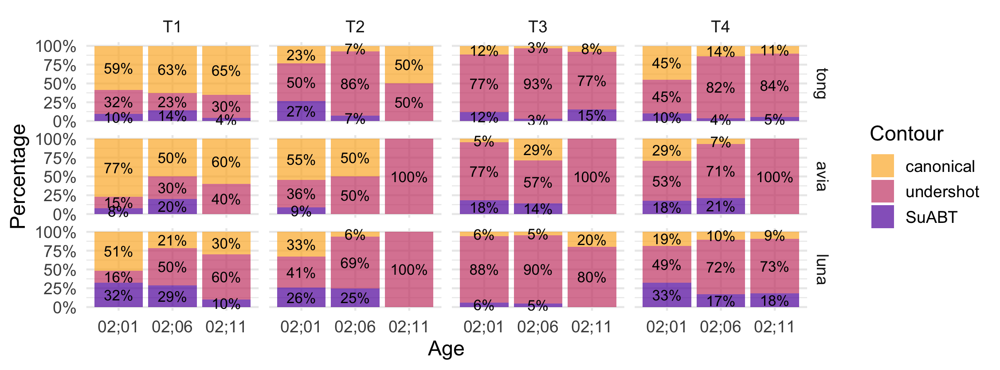

##### Download

+ [Conference Abstract](HISPhonCog2026_abstract.pdf)
+ [Conference Slides](HISPhonCog2026_slides.pdf)

---

##### Abstract

This study examined the early production of boundary tones in Mandarin declaratives by monolingual and Mandarin-English bilingual children. Since f0 serves both lexical and intonational information in Mandarin, utterance-final syllables are crowded with both lexical tones and boundary tones, making them a key site of tone-intonation interaction. Using naturalistic data from the Tong Corpus and CHCC, the study analysed declaratives produced by children at 2;01, 2;06, and 2;11. Utterance-final syllables were coded by lexical tone and analysed through contour clustering based on f0 velocity and duration. Three contour types were identified: canonical, undershot, and successive-addition boundary tones. Exploratory analyses suggested that boundary tone realisation might be shaped by age, lexical tone category, and speaker profile. The findings provided corpus-based evidence that Mandarin-speaking children produce boundary tones early in development, while their realisation remains variable across development.

---

###### Figure 2. Proportion of contour categories (Speaker × Age × Tone) for different declarative-final lexical tones produced by the three children.

---

##### Citation

**Zhou, W**. (2026, May 22). Early production of boundary tones in Mandarin declaratives: Contour clustering of monolingual and bilingual child speech  [Oral presentation]. Hanyang International Symposium on Phonetics and Cognitive Sciences of Language 2026 (<a href='https://site.hanyang.ac.kr/web/hisphoncog' style = 'color: gray;'>HISPhonCog 2026</a>), May 22-23, Seoul, Korea.
