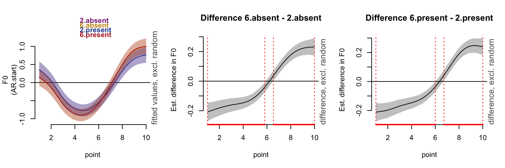
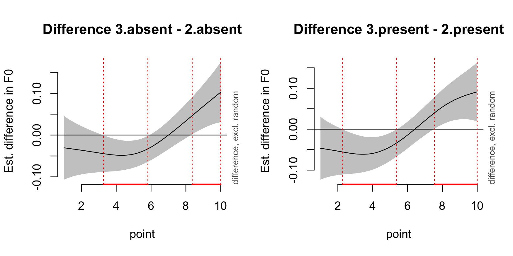

##### Download

+ [Conference Abstract](LabPhon20_abstract.pdf)
+ [Conference Poster](LabPhon20_poster.pdf)
+ [Poster VoiceOver](LabPhon20_voiceover.mp3)
+ [Poster Presentation](https://mycuhk-my.sharepoint.com/:v:/g/personal/1155226199_link_cuhk_edu_hk/IQDW1DxsBocSR5Na60MBMOgmAW1EHUkqCu9I-BcyfrZhqQw?nav=eyJyZWZlcnJhbEluZm8iOnsicmVmZXJyYWxBcHAiOiJPbmVEcml2ZUZvckJ1c2luZXNzIiwicmVmZXJyYWxBcHBQbGF0Zm9ybSI6IldlYiIsInJlZmVycmFsTW9kZSI6InZpZXciLCJyZWZlcnJhbFZpZXciOiJNeUZpbGVzTGlua0NvcHkifX0&e=whiXwA)

---

##### Abstract

Previous studies have suggested that young speakers of Changsha Xiang (CSX) may be merging the two low-rising tones, T2 and T6. In the local Mandarin variant (evolved from Xiang-Mandarin contact) they use every day, namely, Changsha Plastic Mandarin (CPM), the low-rising surface tone encompasses CSX T2 words, CSX T6 words, and sandhi T3 words. This study investigated how CSX–CPM bilinguals realise and represent these categories through contrastive hyperarticulation in the context of tone merger, sandhi alternation, and bilingual phonology. A word-naming experiment with minimal-pair competitor manipulation was conducted to record disyllabic productions from CSX–CPM bilingual speakers. Generalised additive mixed modelling was used to examine the f0 contours of CSX T2/T6 in CSX, CSX T2/T6 in CPM, and CPM sandhi T3. Results showed that the T2/T6 contrast remained robust in CSX but was largely neutralised in CPM. Nevertheless, in CPM, while T2 and sandhi T3 displayed systematic contour differences, T6 and sandhi T3 did not. Furthermore, contrastive hyperarticulation emerged selectively. Specifically, T2 and sandhi T3 were hyperarticulated bidirectionally in CPM; while T6 was significantly hyperarticulated in the presence of a sandhi T3 competitor,  the reverse was not true. Results were discussed in relation to gradient representations and cascading activation.

---

###### Figure 4 & 5. Changsha Xiang: F0 contours of T6 and T2 across competitor conditions & difference curves between T6 and T2 in competitor-absent (left) and competitor-present (right) conditions.

---

###### Figure 7. Changsha Plastic Mandarin: Difference curves between sandhi T3 and T2 in competitor-absent (left) and competitor-present (right) conditions.

---

##### Citation

**Zhou, W.** & Mok, P. (2026, June 26). Contrastive hyperarticulation of low-rising tones in Changsha Xiang and Plastic Mandarin  [Poster presentation]. The 20th Conference on Laboratory Phonology (<a href='https://site.hanyang.ac.kr/web/hisphoncog' style = 'color: gray;'>LabPhon 20</a>), June 26-28, Montreal, Canada.